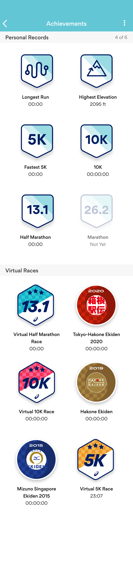

# Overview

Replicate this view in iOS  

# Questions

- How are the sections sorted?
- Once you've accomplished a virtual 5k, can you do it again?
- What would happen when the person has achieved many personal records / virtual races. This view would get really long, so how could that be handled?
- I understand that 5K means 5 kilometres, but when I see I also think 5,000. So I find it a little confusing to exactly what the value is describing,

# Bugs

- Nearly all the times are zero.
- Beside personal record 4 of 6 is supposed to mean the amount of events you've accomplished, so in the example given it should read 5 of 6.
- Distances are in metric (Fastest 5K, 10K, etc), but elevation is in imperial.
- For 10k, half, and marathon, the word fastest is missing. Since 5k had it I expected the others to also have it.
- Some titles say the year of the event (Tokyo-Hakone Ekiden 2020) and some do not (Hakone Ekiden)

# Possible Future Improvements

- Show an event as not completed. Currently the text would change, but the alpha of the image would not. 
- Support multiple languages? Only English is currently supported.
- Support dark mode appearance? Currently hardcoded in Light Mode.
- Landscape support? Currently hardcoded in portrait.
- Show the date the achievement was accomplished.
- Longest run to show both time and distance. Could be two different achievements.
- To be able to click on the achievement and see the run you achieved it on.
- See the top 5 of an achievement. I really like this feature to see if my best time was a fluke or a perfect day or does it align to similar other times I've accomplished.
- To be able to click on the achievement and remove the achievement if you think it's invalid. Bad GPS can cause this.
- Instead of showing Not Yet showing the Train For It button like the old version.
- Adding the ability for the customer to pick the categories they want. For example I'm an ultra runner and would want to see fastest 50K, fastest 50mile, etc. But maybe a track runner would want to see fastest 400 meters, fastest 1k, fastest mile.
- Showing a virtual event in progress. For example the virtual event is to run 200 miles and you are 35 miles into it.
- For events that occur yearly easily being able to sign up for the next year.
- Grouping a yearly event you've done multiple times.
- Showing future events and ability to sign up.
- Add support for days in the time field. This is if relative achievements make it needed.
